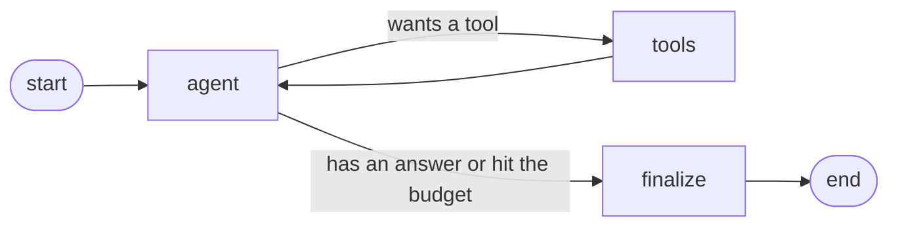

# Internal Knowledge Assistant

An agentic retrieval system that answers questions over a company's internal
documents. It gives answers that are grounded in the documents, cites the exact
sources it used, and refuses to answer when the documents do not support a
response. It is built with FastAPI, PostgreSQL with the pgvector extension, and
Amazon Bedrock for both embeddings and text generation.

The point of the project is not just to retrieve and generate. It is to treat
model output as something to check rather than trust. There is a real evaluation
layer that scores whether answers follow from their sources and flags the ones
that do not.

## Contents

- [What it does](#what-it-does)
- [Architecture](#architecture)
- [The RAG design decisions](#the-rag-design-decisions)
- [The agent design](#the-agent-design)
- [The evaluation layer](#the-evaluation-layer)
- [Running it locally](#running-it-locally)
- [Deploying to AWS](#deploying-to-aws)
- [Production engineering included](#production-engineering-included)
- [What is verified](#what-is-verified)
- [Honest scope: what a full production assistant would add](#honest-scope-what-a-full-production-assistant-would-add)

## What it does

You send a question to `POST /query`. The service decides which of its tools can
answer, gathers evidence, and writes an answer that cites the evidence. If it
cannot find support, it says so.

```jsonc
// POST /query  { "question": "Is multi-factor authentication required, and what second factor do engineers with production access need?" }
{
  "question": "Is multi-factor authentication required, and what second factor do engineers with production access need?",
  "answer": "Yes. MFA is mandatory for all Meridian accounts, including email, the code repository, cloud consoles, and the VPN [1]. Engineers with production access must use a FIDO2 hardware security key as the second factor. SMS codes are not permitted [1].",
  "no_answer": false,
  "citations": [
    {
      "marker": 1,
      "source_type": "document",
      "document_title": "Meridian Information Security Policy",
      "heading_path": "Meridian Information Security Policy > Authentication and Multi-Factor Authentication",
      "source_path": "corpus/security-policy.md",
      "similarity": 0.63,
      "snippet": "..."
    }
  ],
  "model_id": "us.anthropic.claude-sonnet-4-5-20250929-v1:0",
  "retrieved_count": 4,
  "latency_ms": 1120,
  "steps": ["search_documents(query='multi-factor authentication requirement') -> 4 passage(s)"]
}
```

There are two query endpoints:

- `POST /query` runs the agent. It can decide whether to retrieve, call more than
  one tool, and take several steps before answering.
- `POST /query/simple` runs a single retrieval followed by one generation, with
  no agent loop. It is kept as a baseline so you can compare the two.

`GET /health` reports whether the database is reachable and how many documents
and chunks are loaded.

## Architecture

At a high level, a question flows through retrieval, a grounding check, and
generation. Ingestion is a separate offline path that fills the vector store.

```mermaid
flowchart LR
    Q[Question] --> API[FastAPI /query]
    API --> AGENT[Agent loop]
    AGENT -->|embed query| BEDROCK_E[Bedrock Titan embeddings]
    AGENT -->|vector search| PG[(PostgreSQL + pgvector)]
    AGENT -->|structured lookup| DIR[(Directory JSON)]
    AGENT -->|generate answer| BEDROCK_C[Bedrock Claude]
    AGENT --> RESP[Answer + citations + no_answer]

    subgraph Ingestion (offline)
      DOCS[corpus/*.md] --> CHUNK[chunker] --> EMB[Titan embeddings] --> PG
    end
```

### Repository layout

| Path | What lives there |
|------|------------------|
| `app/main.py` | App factory, lifespan, middleware, error handlers |
| `app/config.py` | Typed settings loaded from environment and `.env` |
| `app/api/` | Routes (`/query`, `/query/simple`, `/health`), middleware, error responses |
| `app/rag/retriever.py` | Embed the query, run the vector search, apply the relevance gate |
| `app/rag/prompts.py` | The grounding system prompt and source formatting |
| `app/rag/service.py` | The single-shot baseline path |
| `app/rag/llm.py` | Bedrock Claude calls, including tool calling |
| `app/rag/embeddings.py` | Bedrock Titan embedding calls |
| `app/agent/graph.py` | The LangGraph state machine (agent, tools, finalize nodes) |
| `app/agent/tools.py` | The two tools and their executors |
| `app/agent/directory.py` | The structured directory lookup |
| `app/agent/service.py` | Runs the graph and shapes the response |
| `app/ingestion/chunker.py` | Structure-aware Markdown chunking |
| `app/ingestion/pipeline.py` | Load, chunk, embed, store |
| `app/db/repository.py` | All SQL, including the vector search |
| `app/eval/` | The evaluation layer (dataset, metrics, faithfulness judge, runner) |
| `corpus/` | The internal document corpus (7 documents) |
| `data/directory.json` | The structured org directory |
| `eval/dataset.json` | The labeled evaluation questions |
| `deploy/` | Dockerfile support, the AWS runbook, the Bedrock IAM policy |

## The RAG design decisions

These are the choices that decide answer quality, with the reasoning behind each
one.

### Chunking: split on structure, size by tokens, add overlap

The chunker is in `app/ingestion/chunker.py`. It makes four choices.

1. It splits on Markdown headings first. Internal documents are written in
   sections, and a heading marks a change of topic. Cutting on headings keeps
   each chunk about one subject, which is what a vector search needs, because one
   vector should represent one idea. The full heading path, for example
   "Security Policy > Authentication > MFA", is kept as metadata and is also
   placed at the top of the chunk text before embedding, so the section's context
   is part of what gets embedded and citations can say where in a document an
   answer came from.

2. It packs text up to a token budget of about 450 tokens rather than a character
   count. Embedding and generation both work in tokens. Chunk size is a dial
   between precision and recall. Chunks that are too large put several facts into
   one vector, which lowers precision. Chunks that are too small lose the context
   needed to answer, which lowers recall. About 450 tokens is a few paragraphs,
   which suits policy text.

3. It respects natural boundaries. It packs whole paragraphs, and only falls back
   to splitting on sentences when a single paragraph is larger than the budget. It
   never cuts in the middle of a sentence.

4. It adds an overlap of about 60 tokens between neighbouring chunks. The end of
   one chunk is repeated at the start of the next, so a fact that sits on a chunk
   boundary is still complete in at least one chunk. This costs a little storage
   and improves recall on boundary questions.

One guard is worth calling out. A tiny leftover fragment is folded back into the
previous chunk only when it belongs to the same section. It is never merged
across sections, because that would file text under the wrong heading and produce
a wrong citation. A unit test caught exactly this bug during the build, which is
why the rule is explicit.

Token counting uses `tiktoken` as a fast stand-in. Titan and Claude count tokens
a little differently, but for sizing chunks all that matters is a consistent count
at roughly the right scale.

### Embeddings: Amazon Titan Text Embeddings v2

- It is part of Bedrock, so it shares credentials and networking with the Claude
  model. That means one vendor and one access setup for an internal tool, and no
  extra key to manage.
- Its output size is configurable at 256, 512, or 1024 dimensions. This project
  uses 1024 for a corpus that covers several different topics. A narrow corpus
  could use a smaller size to cut storage and speed up the search.
- It returns vectors that are already normalised to unit length, so cosine
  distance in pgvector maps directly to a similarity of one minus the distance,
  and the relevance threshold is easy to reason about.
- The same model embeds both the stored chunks and the query, so the two live in
  the same space.

The embedding call sits behind one small module. Switching to Cohere on Bedrock
or an open model is a change to that module plus a re-index, because a new model
means re-embedding the whole corpus and the vector column size must match.

### Vector store: PostgreSQL with pgvector, HNSW index, cosine distance

- pgvector keeps the vectors next to the ordinary relational data, so documents,
  chunks, and any future access rules live in one database with normal
  transactions. There is no separate vector service to run.
- The index is HNSW using the cosine operator class. HNSW gives good recall and
  latency at this scale and needs no training step, unlike IVFFlat. At a scale of
  millions of vectors this choice would be worth revisiting.
- The search is plain SQL in `app/db/repository.py`. It orders by the pgvector
  cosine operator and returns the similarity as one minus the distance, so the
  rest of the code works with a plain 0 to 1 score.

### Grounding: refusing before generating

Faithfulness starts at retrieval, not at the model. The retriever drops any chunk
below a similarity threshold. If nothing clears the threshold, the code does not
call the model at all and returns a fixed "I do not know" response. When the model
does run, the system prompt tells it to use only the given sources, to cite each
fact, and to reply with an exact refusal sentence when the sources do not answer
the question. Generation runs at temperature zero for repeatable, literal answers.

## The agent design

A single model call cannot decide to retrieve, retrieve a second time, or combine
two different sources. It answers in one pass. Making the assistant agentic means
giving the model a loop where it chooses a tool, sees the result, and chooses
again. This project uses LangGraph to model that loop as a state machine that you
can read and test. The transport to Bedrock is the project's own code, so the
model choice stays a configuration value and LangGraph is only the control flow.



### Why each node exists

- The `agent` node is the decision maker. It calls Claude with the two tool
  descriptions. Claude either asks to call a tool or writes a final answer. This
  is the node that decides whether and what to retrieve. Putting it in a loop is
  what lets it handle a question with more than one part.
- The `tools` node runs whatever tool the agent asked for, adds the result back
  into the conversation, and records the sources. Keeping tool execution in its
  own node keeps the side effects, the database and the directory reads, out of
  the model-facing node and makes the tools easy to test on their own.
- The `finalize` node is the grounding check. It decides the `no_answer` flag and
  works out which sources the answer actually cited. This is where the rule "say
  you do not know rather than guess" is enforced in code. If no tool produced any
  usable source, or the model returned the refusal sentence, the answer is forced
  to a refusal. The model's word alone is never taken as grounded.

The edge out of the `agent` node is the routing decision. It loops to `tools`
while the model wants a tool and the step budget remains, and otherwise goes to
`finalize`. The step budget, set by `max_agent_steps`, stops the loop so a
confused agent cannot retrieve forever.

### The two tools

Giving the agent two differently shaped sources is what makes tool choice a real
decision instead of a formality.

- `search_documents` runs the retriever over the prose corpus. Use it for policy,
  benefits, process, and how-to questions.
- `lookup_directory` reads a small structured directory in `data/directory.json`.
  It holds facts you would not write as prose, such as which team owns a topic,
  the contact channel, the escalation path, who is on call, and office addresses.
  Use it for who-to-contact, which-team, channel, on-call, and office questions.

The directory match is on whole words, not raw substrings. An earlier substring
version matched the alias "it" inside the word "security", so an IT question and a
security question collided. The whole-word version fixed that, and there is a test
for it.

### Citations

Every fact the agent can cite, whether a document chunk or a directory record,
becomes a source with a number. Numbers are handed out in the order sources are
gathered across the whole run, so they stay stable even when the agent calls a
tool several times or mixes the two tools. The model cites those numbers in its
answer. The `finalize` node reads back the numbers the model actually wrote and
returns only those sources as citations, so the citation list reflects what the
answer used, not just what was retrieved.

## The evaluation layer

This is the part that checks the system rather than trusting it. It lives in
`app/eval/` and runs against a labeled dataset in `eval/dataset.json`. The
dataset has 19 questions in three kinds:

- policy questions, where the answer is in the documents and the relevant
  documents are labeled, so retrieval can be scored.
- directory questions, where the answer is in the structured directory.
- unanswerable questions, where nothing in the corpus supports an answer and the
  correct behaviour is to refuse. These are how hallucination is measured.

For each question the evaluator takes three independent measurements. Running
retrieval separately from the agent is deliberate, because it lets a failure be
blamed on the right layer: bad retrieval versus bad generation.

### Retrieval metrics

These compare the ordered list of documents the retriever returns against the
labeled relevant documents.

- hit@k asks whether at least one relevant document appeared in the top k. If this
  is low, the model never saw the right context, so a wrong answer is retrieval's
  fault.
- recall@k asks what fraction of the relevant documents appeared in the top k. It
  matters when a question needs more than one document.
- precision@k asks what fraction of the retrieved chunks were relevant. Low
  precision means the model is being fed noise, which costs more and gives it room
  to ground on the wrong passage.
- MRR, mean reciprocal rank, is one divided by the rank of the first relevant
  document, averaged over questions. It rewards putting the right document near
  the top, which is what the model reads first.

### Behaviour metrics

These score the decision to answer or refuse.

- behaviour accuracy is the fraction of questions where the system answered when
  it should and refused when it should.
- false answer rate is, of the questions that should be refused, how many were
  answered. This is the hallucination rate on unanswerable questions, and it is
  the number to watch most.
- false refusal rate is, of the questions that should be answered, how many were
  refused.

### Faithfulness

Retrieval metrics tell you the right context was fetched. Faithfulness tells you
the answer stayed inside that context. An answer can cite a real source and still
add a claim the source never makes, so this is a separate check.

Faithfulness is judged by a second model call, an approach usually called LLM as
judge. The judge sees only the question, the answer, and the source passages the
answer cited, and is told to use no outside knowledge. It returns a verdict of
supported, partial, or unsupported, and lists the specific claims it could not
find support for. The verdict maps to a score of 1.0, 0.5, or 0.0. An answer is
flagged when the judge does not fully support it, or when the system answered a
question it should have refused.

This is honest about its limits. The judge is itself a model and can be wrong, so
it runs at temperature zero with a strict prompt, and it reports the exact claims
it doubts so a person can check them. A stronger setup would use a different model
family as the judge and calibrate it against human labels. The judge parser never
raises on a malformed reply. It records an "unknown" verdict instead, so one bad
judge call cannot crash a run.

### Running the evaluation

The metric math, the judge parser, and the dataset labels are covered by unit
tests that need no Bedrock or database, so quality checks run in normal CI. The
full scored run against live Bedrock is a separate script:

```bash
py -3.11 -m scripts.evaluate            # the whole dataset
py -3.11 -m scripts.evaluate --limit 5  # the first 5 cases while iterating
```

It prints a per-case table and the aggregate scores. A healthy result is a high
hit@k and MRR, a false answer rate at or near zero on the unanswerable cases, and
a mean faithfulness near 1.0 with nothing flagged. The script calls Bedrock, so
see the cost note in the deploy runbook before running the whole set.

## Running it locally

### Prerequisites

- Python 3.11 and Docker.
- AWS credentials with Bedrock access, and model access enabled in the Bedrock
  console for the Titan and Claude models in your region. Bedrock model
  availability depends on the region, and `us-east-1` has the widest selection.

### Steps

```bash
cp .env.example .env
# edit .env: set AWS_REGION or AWS_PROFILE, and set BEDROCK_LLM_MODEL_ID to a
# model you have enabled. List what you can call:
#   aws bedrock list-inference-profiles --region us-east-1
```

```bash
py -3.11 -m venv .venv
./.venv/Scripts/python.exe -m pip install -r requirements-dev.txt
```

```bash
docker compose up -d          # PostgreSQL with pgvector on host port 5434
py -3.11 -m scripts.check_bedrock   # confirm credentials and model access
py -3.11 -m scripts.ingest          # embed the corpus into the database
./.venv/Scripts/python.exe -m uvicorn app.main:app --reload
```

Open `http://localhost:8000/docs` for the API UI, or ask a question directly:

```bash
curl -s localhost:8000/query -H 'content-type: application/json' \
  -d '{"question":"How many days of annual leave do employees get?"}'
```

The database uses host port 5434 because ports 5432 and 5433 were already in use
on the build machine. Change it in `docker-compose.yml` and `.env` if needed.

### Tests

```bash
./.venv/Scripts/python.exe -m pytest
```

The suite covers the parts that decide correctness and runs with no Bedrock and
no database: chunking, prompts, citation parsing, the agent routing and grounding
guard, the directory lookup, the evaluation metrics, the judge parser, the dataset
labels, and the error handling. The database layer is checked separately against
the live pgvector container.

## Deploying to AWS

The full runbook is in [deploy/DEPLOY.md](deploy/DEPLOY.md). It deploys the API as
a container on AWS App Runner, with the database on Amazon RDS for PostgreSQL and
generation on Bedrock.

Read the cost section first. A demo left running costs roughly 15 to 25 USD per
month, almost all of it the RDS instance. Bedrock itself is billed per token and
is a few cents for the whole evaluation suite. The runbook creates every resource
with explicit commands and includes a teardown section that removes all of them.
Nothing in this repository creates cloud resources on its own.

## Production engineering included

- Structured logging. Logs are plain text locally and one JSON object per line
  when `JSON_LOGS` is on, so a log system can index the fields. Turned on in the
  container by default.
- Request tracing. Every request gets a short id, taken from an inbound
  `X-Request-ID` header if present or generated otherwise. The id is put on the
  logging context, so every line logged during a request carries it, and it is
  returned on the response header.
- Error handling. A dependency failure from Bedrock or the database becomes a 503
  with a message the caller can retry, and an unexpected error becomes a 500 that
  leaks no internal detail. Both responses carry the request id. The raw error is
  logged on the server, not sent to the client.
- Clean config. All settings are typed and read from the environment or a `.env`
  file in one place, with no scattered environment reads.
- A health endpoint for the platform to check readiness.

## What is verified

- The unit suite passes: 54 tests covering chunking, prompts, citations, agent
  routing and the grounding guard, the directory lookup, the evaluation metrics,
  the judge parser, the dataset labels, and error handling.
- The corpus of 7 documents chunks into about 51 heading-tagged chunks.
- The PostgreSQL and pgvector stack builds, and the schema and extension load.
- The database read and write path works end to end. An idempotent re-ingest keeps
  the chunk count stable, and a cosine search returns an exact match at similarity
  1.0. This was checked with synthetic vectors, so it needed no Bedrock.
- The container image builds, and the full application imports and starts inside
  it.
- Live Bedrock calls for embeddings, generation, and the evaluation run need your
  AWS credentials. Run `scripts/check_bedrock.py`, then ingest, then query, then
  `scripts/evaluate.py`.

## Honest scope: what a full production assistant would add

This is a real working system, not a toy, but it is scoped to demonstrate the RAG
core, the agent, and the evaluation. A full internal assistant used across a
company would need more. The main gaps, in rough order of importance:

- Access control. Real internal documents have per-document permissions. A
  production system must filter retrieval by who is asking, so a person never sees
  a chunk from a document they are not allowed to read. That means identity,
  authorisation, and access-aware retrieval, none of which is here.
- Prompt injection defence. Retrieved documents are untrusted input. A document
  could contain text that tries to steer the model. A production system needs
  input handling and guardrails that treat document text as data, not
  instructions, plus red-teaming for this. This project does not defend against it.
- A real ingestion pipeline. Here the corpus is a folder of Markdown. A real one
  needs connectors to the actual sources such as a wiki, a drive, or a chat tool,
  incremental sync as documents change, handling for PDFs and other formats, and
  deletion so removed documents leave the index.
- Retrieval quality work. Hybrid search that combines keyword and vector scoring,
  a reranking step, and query rewriting would all raise retrieval quality beyond
  the dense-only search used here.
- Conversation and memory. The service answers one question at a time. A real
  assistant holds a multi-turn conversation and remembers context within it.
- Serving concerns. Streaming responses, response caching, rate limiting and
  per-user quotas, and cost tracking per request are all absent.
- Observability. Beyond logs, a production service needs traces, metrics
  dashboards, latency and cost monitoring, and alerts.
- A feedback and evaluation loop at scale. The evaluation here is a fixed set of
  19 questions. A production system needs a much larger set, human labels to
  calibrate the judge, evaluation gates in CI that block a regression, and a way to
  capture real user feedback and feed it back in.
- Data and compliance. Handling of personal data, retention and deletion rules,
  audit logs of who asked what, and a defined data residency all matter for an
  internal tool and are out of scope here.
- Resilience. A single database instance is a single point of failure. A
  production database needs backups, failover, and a tested recovery plan.
